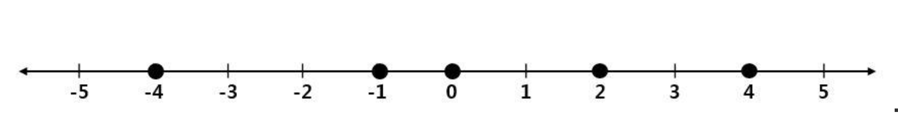

# Three Dots

 

## 🔎 문제
직선 위에 서로 다른 N개의 점이 찍혀 있다. 점 i의 위치는 Xi이다. N개의 점 중 3개를 골라 가장 왼쪽에 있는 점을 a, 가운데 있는 점을 b, 가장 오른쪽에 있는 점을 c라고 하자. 각각의 점의 위치는 Xa, Xb, Xc이다. 이때 점 a, b 사이의 거리와 점 b, c사이의 거리가 같으면 세 점의 간격이 같다고 한다. 즉, Xb - Xa = Xc – Xb일 때 세 점의 간격이 같다. 다음은 N = 5인 경우의 예시이다.

위 예시에서 점의 위치는 각각 -4, -1, 0, 2, 4이다. 이중 -4, -1, 0위치의 세 점을 각각 a, b, c라고 하면 Xb - Xa = 3, Xc – Xb = 1로 간격이 같지 않다. 그러나 -4, -1, 2 위치의 세 점을 각각 a, b, c라고 하면 Xb - Xa = 3, Xc – Xb = 3으로 세 점의 간격이 같다. 위 예시에서 간격이 같은 세 점 a, b, c로 가능한 경우는 (-4, -1, 2), (-4, 0, 4), (0, 2, 4)의 3가지가 있다. N개의 점의 위치가 주어졌을 때, 간격이 같은 세 점으로 가능한 경우가 모두 몇 가지 있는지 출력하는 프로그램을 작성하시오.

 

## 📁 입력
첫 번째 줄에 테스트 케이스의 개수를 나타내는 자연수 T가 주어진다. 다음 줄부터 차례로 T개의 테스트 케이스가 주어진다. 각각의 테스트 케이스의 첫째 줄에 점의 개수 N(3 ≤ N ≤ 1,000)이 주어진다. 테스트 케이스의 둘째 줄에는 N개의 점의 위치 X1, X2, X3 … Xn이 차례로 주어진다. 모든 점의 위치는 -100,000,000이상 100,000,000이하의 정수이다.

 

## 📂 출력
각 테스트 케이스의 답을 순서대로 출력한다. 각 테스트 케이스마다 첫째 줄에 간격이 같은 세 점 a, b, c로 가능한 경우의 수를 출력한다.